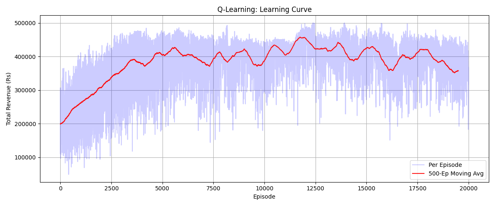

# ✈️ Dynamic Pricing with Reinforcement Learning — Member 2 Contributions

> **Project:** Travel & Hospitality — RL-Based Dynamic Pricing Agent
> **Role:** Member 2 — Baseline Heuristic Agent (Time-Based) + Q-Learning RL Agent
> **Branch:** Swarup
> **Team Project:** Airline/Hotel inventory pricing using OpenAI Gymnasium

---

## 📌 Overview

This repository contains Member 2's contributions to a team reinforcement learning
project that builds an autonomous pricing agent for airline seat inventory.
The agent learns to dynamically adjust prices over a **30-day booking window**
to **maximize total revenue** while ensuring inventory clears before departure.

### My Two Deliverables:
- `agents/time_based_agent.py` — Rule-based heuristic baseline (no learning)
- `agents/qlearning_agent.py` — Tabular Q-Learning agent (learns from experience)

---

## 🗂️ Project Structure

```
infotact_project_1/
│
├── agents/
│   ├── fixed_price_agent.py          ← Member 1
│   ├── time_based_agent.py           ← Member 2 (Me) ✅
│   ├── inventory_based_agent.py      ← Member 3
│   ├── qlearning_agent.py            ← Member 2 (Me) ✅
│   └── dqn_agent.py                  ← Member 3
│
├── environment/
│   └── airline_pricing_env.py        ← Member 1
│
├── models/
│   └── dqn_weights.pth               ← Member 3
│
├── dashboard/
│   └── app.py                        ← Member 4 (Streamlit)
│
├── docs/
│   ├── integration_plan.md
│   └── qlearning_research_notes.md
│
├── run.py
├── test_env.py
├── requirements.txt
└── README.md
```

---

## 🧠 My Deliverables

### 1. `time_based_agent.py` — Heuristic Baseline

A **rule-based pricing agent** that requires no training or learning.
It linearly decreases the price index as departure approaches —
mimicking a common real-world airline pricing pattern.

**How it works:**
- 30 days out → charges high price (index 15 = Rs 8,000)
- 15 days out → charges mid price (index ~8 = Rs 4,500)
- 1 day out  → charges low price (index 2 = Rs 1,500)

**Formula:**
```
action_idx = low_idx + (days_remaining / max_days) * (high_idx - low_idx)
```

**Purpose:** Acts as a performance baseline — Q-Learning must beat this to prove the value of RL.

---

### 2. `qlearning_agent.py` — Tabular Q-Learning Agent

A **reinforcement learning agent** that learns the optimal pricing policy
by building a Q-table over the state-action space.

**MDP Formulation:**

| Component | Definition |
|-----------|-----------|
| **State** | `[remaining_inventory, days_until_departure]` |
| **Action** | Price index (0–19) → Rs 500 to Rs 10,000 |
| **Reward** | Revenue = `price × seats_sold` per step |
| **Policy** | `argmax Q(s, a)` after convergence |

**Key Design Decisions:**

| Decision | Choice | Reason |
|----------|--------|--------|
| State space | Bucketed (10×10) | Reduces Q-table from 31,620 → 2,000 values for faster convergence |
| Q-table init | Optimistic (200,000) | Encourages exploration of all states |
| Alpha | 0.2 | Higher learning rate for faster updates |
| Gamma | 0.99 | Values long-term revenue highly |
| Epsilon decay | 0.9995 | Slow decay ensures thorough exploration |

**Bellman Update Rule:**
```
Q(S,A) ← Q(S,A) + α × [R + γ × max Q(S',A') − Q(S,A)]
```

---

## 📊 Results — Actual Performance

Trained over **20,000 episodes**, evaluated over **1,000 episodes**:

| Agent | Mean Revenue | Improvement |
|-------|-------------|-------------|
| **Time-Based Baseline** | Rs 3,07,000 | — |
| **Q-Learning Agent** | Rs 4,50,000 | **+46.60% ✅** |

### Learning Curve
The Q-Learning agent shows a clear upward learning curve:
- **Episodes 0–2,500:** Exploration phase — random prices, low revenue
- **Episodes 2,500–10,000:** Learning phase — revenue rises steadily
- **Episodes 10,000–20,000:** Convergence — policy stabilizes around Rs 4,50,000



---

## 🚀 How to Run

### Install Dependencies
```bash
pip install -r requirements.txt
```

### Run Full Training + Evaluation
```bash
python run.py
```

### Test Environment Only
```bash
python test_env.py
```

### Run Individual Agents
```bash
python agents/time_based_agent.py
python agents/qlearning_agent.py
```

---

## 📅 Weekly Progress Log

### Week 1 — Environment Study & Planning
- ✅ Studied MDP formulation for airline pricing problem
- ✅ Reviewed `airline_pricing_env.py` (Member 1)
- ✅ Identified state space: `[remaining_inventory, days_until_departure]`
- ✅ Mapped action space: 20 discrete price levels (Rs 500–Rs 10,000)
- ✅ Created skeleton files with full logic plan and comments
- ✅ Added `docs/qlearning_research_notes.md` with hyperparameter research
- ✅ Added `docs/integration_plan.md` for connecting with environment

### Week 2 — Implementation & Training
- ✅ Implemented `select_action()` with epsilon-greedy strategy
- ✅ Implemented `update_q_table()` with Bellman equation
- ✅ Implemented `decay_epsilon()` with exponential decay
- ✅ Connected agents to `AirlinePricingEnv` (Member 1)
- ✅ Diagnosed poor learning curve — fixed with bucketed state space
- ✅ Applied optimistic Q-table initialization (200,000)
- ✅ Trained for 20,000 episodes — achieved **+46.60% over baseline**
- ✅ Generated learning curve and policy heatmap plots

---

## 🔑 Key Concepts Applied

- **Markov Decision Process (MDP):** Sequential pricing decisions under uncertainty
- **Q-Learning:** Model-free, off-policy RL using a value table
- **Bellman Equation:** Recursive Q-value update rule
- **State Space Bucketing:** Reduces table size for faster convergence
- **Optimistic Initialization:** Encourages exploration of unvisited states
- **Epsilon-Greedy Exploration:** Balances exploration vs exploitation
- **Revenue Management:** Balancing margin vs inventory spoilage

---

## 🤝 Team Members

| Member | Role |
|--------|------|
| Member 1 | Gym Environment + Fixed Price Agent |
| **Member 2 (Me)** | **Time-Based Agent + Q-Learning Agent** |
| Member 3 | Inventory-Based Agent + DQN Agent |
| Member 4 | Streamlit Dashboard |

---

## 📚 References

- Sutton & Barto — *Reinforcement Learning: An Introduction* (2nd Ed.)
- OpenAI Gymnasium Documentation
- Watkins & Dayan (1992) — *Q-Learning*, Machine Learning Journal

---

*Last updated: June 23, 2026 | Mid Review: June 27, 2026 | Final Review: July 5–10, 2026*
